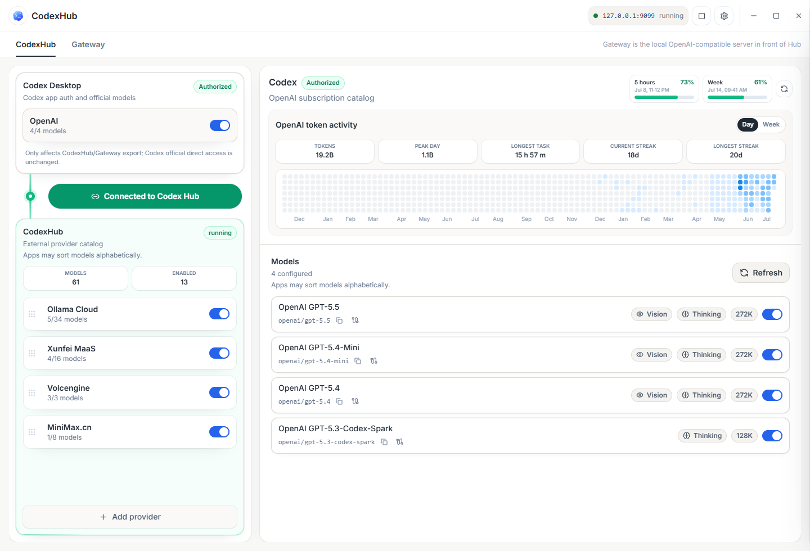
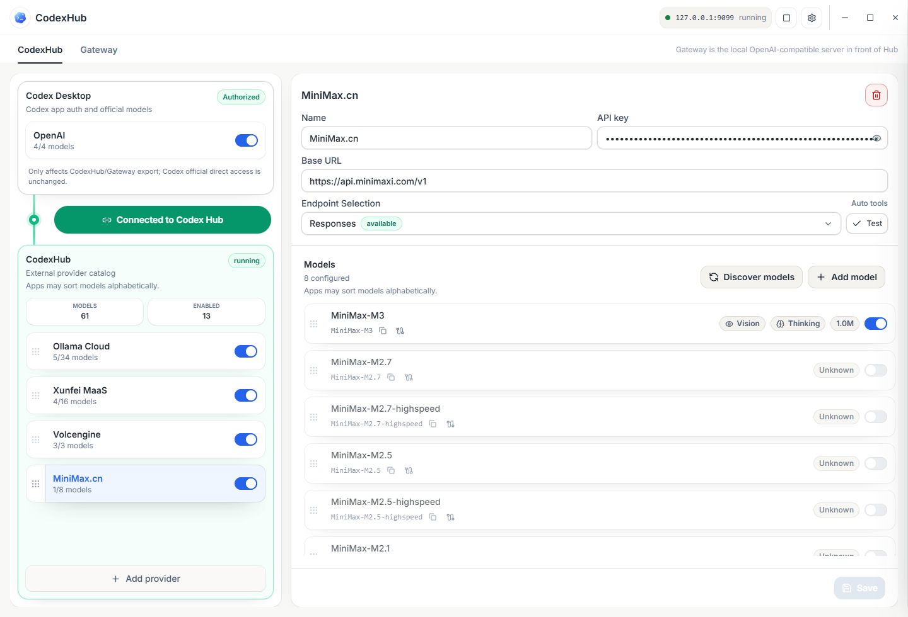
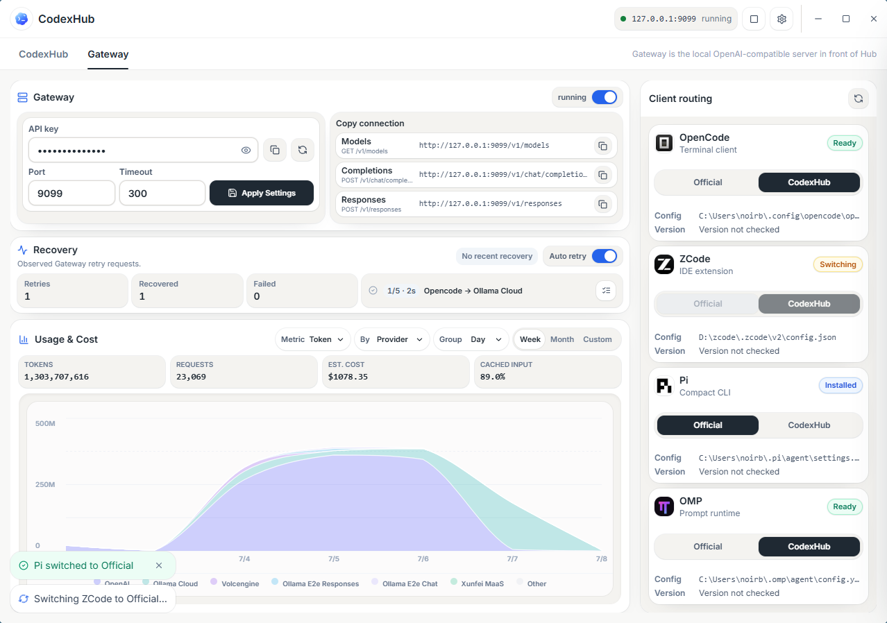
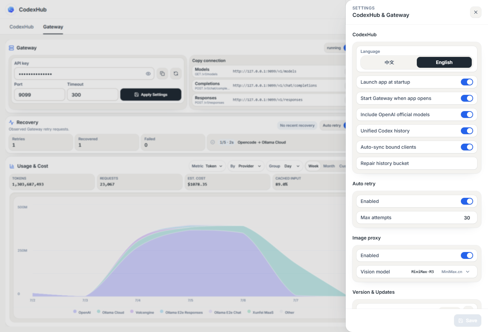

# CodexHub

> [中文](README.zh-CN.md) | English

> The model-access console for Codex desktop users: official subscription and third-party models side by side — stable, visible, and reversible.

CodexHub is a desktop app plus local Gateway. It lets Codex Desktop use official GPT subscription models and third-party models in the same model catalog, keeps tool calls and subagents dependable on curated providers, shows per-model usage, cost, and health, and can always restore Codex to its native state without losing history. It also exposes those models through a local OpenAI-compatible endpoint for tools such as OpenCode, ZCode, Pi, and OMP.

## How It Works

```text
Codex Desktop App
        |
        |  http://127.0.0.1:9099
        v
CodexHub Gateway
        |-- Official Codex / ChatGPT subscription models
        |-- OpenAI-compatible providers
        |-- Responses API providers
        `-- Chat Completions providers

CodexHub Desktop App
        |-- configure providers and models
        |-- generate Codex model catalog
        |-- start / stop / monitor Gateway
        `-- configure external coding clients
```

After Codex is connected to CodexHub, the Gateway must keep running because Codex sends model requests to the local endpoint. For official GPT models, CodexHub behaves as a transparent proxy whenever possible: it reuses the local Codex login, forwards requests, and only adds the authentication injection, compatibility handling, usage capture, and health checks required for the route. For third-party models, the Gateway chooses the best upstream protocol from the Provider configuration and performs minimal conversion when client and provider capabilities do not line up.

The desktop app and Gateway have independent lifecycles. Closing the window hides it to the tray; it does not stop the Gateway. You can also start, stop, or restart the Gateway from the UI, tray menu, or CLI.

**Figure 1: Real-account Provider catalog and connection state**



## Core Features

- **Codex multi-model catalog**: use official subscription models and third-party models from the same Codex model picker.
- **Transparent official proxy**: official GPT models use the local Codex / ChatGPT login, so external tools do not need to understand OpenAI subscriptions.
- **Provider capability adaptation**: configure each Provider as Responses or Chat Completions, or use Probe to detect the best endpoint type.
- **Protocol conversion**: convert between Responses API and Chat Completions when the client and upstream use different wire formats.
- **Codex capability compatibility**: preserve Codex tool calls, subagents, and streaming behavior for third-party models as much as the upstream provider allows.
- **External Gateway**: expose `/v1/models`, `/v1/responses`, `/v1/chat/completions`, and provider-scoped routes.
- **Vision Proxy**: when the target model cannot accept images, use a configured vision model to read the image and pass text context to the non-vision model.
- **Usage and recovery telemetry**: record requests, tokens, cache hits, estimated cost, retries, recoveries, and errors.
- **Managed client configuration**: generate, apply, and restore Gateway configs for OpenCode, ZCode, Pi, and OMP.
- **Desktop updates and autostart**: check for updates, install updates, launch on login, and start Gateway when the app opens.

## Quick Start

1. Download and install CodexHub from [Releases](../../releases).
2. Make sure Codex Desktop / Codex CLI is signed in with your ChatGPT subscription account.
3. Open CodexHub and confirm Gateway is running; click Start if it is stopped.
4. On the CodexHub page, click Connect to Codex Hub so Codex Desktop uses the local Gateway.
5. Add a third-party Provider with `base_url`, API key, and model list.
6. If you are unsure which endpoint type the provider supports, click Probe. CodexHub will detect whether Responses or Chat Completions is the better fit.
7. Enable the models you want to expose to Codex/Gateway, refresh the catalog, then select them in Codex.
8. To connect other coding tools, open the Gateway page and either copy the generic connection info or apply managed configuration for a supported client.

Release installers include the runtime required for normal use. Normal users do not need to install Python, Node.js, or Rust separately. Source development still requires local Node.js, Rust/Tauri tooling, and Python.

## Normal And Debug Build Flavors

Each release tag produces two release-optimized CodexHub artifacts from the same commit and semantic version:

- `normal` is the default build. It retains the existing `latest.json` update contract and `CodexHub_<version>_x64-setup.exe` installer name.
- `debug` is selected explicitly at build time and enables diagnostic capability code. It uses `latest-debug.json` and `CodexHub_<version>_debug_x64-setup.exe`, so its updater cannot silently switch to `normal`.

Both flavors share the same application identifier, installed application, ports (`1420`/`1421`/`9099`), `%USERPROFILE%\.codex` runtime home, settings, and Gateway owner. They are not separate products or Rust/Tauri development builds. Installing one flavor over the other at the same version replaces the installed app while preserving supported runtime data; do not run them as side-by-side installations.

The build scripts reject unsupported flavor names before compilation. Use the normal default or select debug explicitly:

```powershell
# Portable build plans (no compilation)
.\scripts\build-windows-portable.ps1 -DryRun
.\scripts\build-windows-portable.ps1 -Flavor debug -DryRun

# Signed, release-optimized installer builds
.\scripts\build-windows-release.ps1 -Flavor normal
.\scripts\build-windows-release.ps1 -Flavor debug
```

Both installer artifacts and both manifests belong to the same GitHub Release tag. Debug manifests declare their flavor and artifact name; a mismatch is rejected before download/install. A normal manifest without flavor metadata remains accepted only when it points to the historical normal artifact name, preserving installed normal-user update compatibility.

For a packaged same-version replacement smoke, first inspect the contract, then run the explicit installer sequence only in a dedicated Windows test environment with a known settings fixture:

```powershell
.\scripts\Test-BuildFlavorReplacement.ps1 -DryRun
.\scripts\Test-BuildFlavorReplacement.ps1 `
  -Version 0.1.5 `
  -NormalInstaller .\CodexHub_0.1.5_x64-setup.exe `
  -DebugInstaller .\CodexHub_0.1.5_debug_x64-setup.exe `
  -SettingsPath "$env:USERPROFILE\.codex\proxy\settings.json" `
  -InstalledExe 'C:\path\to\CodexHub.exe' `
  -RunInstall -LaunchAfterInstall
```

The smoke proves normal → debug → normal replacement preserves the supplied settings file and observes exactly one Gateway listener. It is intentionally opt-in because it runs signed installers.

## Usage

### Connecting Codex

CodexHub updates the Codex configuration so model requests go to the local Gateway. Once connected:

- Official models are still official Codex / ChatGPT subscription models; they are just routed through the local Gateway.
- Third-party models appear in the same model catalog, usually as `provider/model`.
- If the Gateway stops, Codex cannot forward requests while in CodexHub mode. Switch back to Official to restore Codex direct mode.
- The default local endpoint is `http://127.0.0.1:9099`.

CodexHub does not try to replace the Codex protocol. It stays transparent for official models and adds compatibility for third-party models only where needed.

**Figure 2: Use official and third-party models side by side in Codex**


### Configuring Providers

Each Provider needs:

- `name`: display name.
- `base_url`: upstream API base URL.
- `api_key`: either a literal key or an `{env:ENV_NAME}` environment variable reference.
- `upstream_format`: usually `responses`, `chat_completions`, or `auto`.
- Models: each model can define display name, context window, output limit, enabled state, and Gateway export state.

Use Probe when the upstream capability is unclear. Probe checks model listing, Responses, Chat Completions, tool calls, and streaming tool calls, then recommends an endpoint type. Better Provider metadata lets the Gateway stay more transparent and convert less.



### Handling Capability Mismatches

The Gateway respects Provider configuration first:

- Responses client to Responses upstream stays as transparent as possible.
- Chat Completions client to Chat Completions upstream stays as transparent as possible.
- When client and upstream protocols differ, the Gateway converts Responses ↔ Chat Completions.
- When a third-party model lacks Codex-style tool semantics, the Gateway adapts through the configured tool protocol or text compatibility path.
- When upstream streaming fails, returns empty output, or hits a retryable error, the Gateway retries according to policy and records recovery events.

Codex traffic gets the stronger Codex compatibility adapter. External tools get normal OpenAI-compatible Gateway behavior wherever possible.

### External Gateway

The Gateway exposes local OpenAI-compatible routes:

```text
GET  /health
GET  /v1/models
POST /v1/responses
POST /v1/chat/completions
POST /v1/providers/{provider}/responses
POST /v1/providers/{provider}/chat/completions
```

Generic clients can use:

```text
Base URL: http://127.0.0.1:9099/v1
API key:  Local client key from CodexHub settings
Model:    gpt-5.5 or provider/model
```

Official OpenAI models use bare IDs. Legacy `openai/gpt-*` aliases remain accepted for compatibility.

Provider-scoped clients can use:

```text
Base URL: http://127.0.0.1:9099/v1/providers/{provider}
Model:    model
```

The Gateway page detects local OpenCode, ZCode, Pi, and OMP config locations and can copy, preview, apply, or restore managed configs.



**Figure 3: Use your OpenAI subscription in software that cannot sign in with OpenAI auth**


### Vision Proxy

Vision Proxy lets non-vision models handle image requests. When enabled, choose an image-capable model as the Vision model.

It triggers when:

- the request contains image input,
- the target model is not marked as supporting `image` input,
- Image Proxy is enabled in Settings, and
- the configured Vision model is available and image-capable.

Flow:

1. The Gateway asks the configured Vision model to describe the image.
2. The image description is cached locally to avoid repeated reads for the same image.
3. The Gateway replaces the original image part with text visual context.
4. The non-vision target model receives a normal text request.

If the target model already supports image input, the Gateway leaves the image alone. If the target model does not support images and Vision Proxy is disabled or unavailable, the Gateway blocks the request instead of sending image input to a text-only model.

Provider models default to text-only. If a third-party model actually supports image input, mark it as Vision-capable in the model settings or add `input_modalities = ["text", "image"]` to its configuration.



**Figure 4: Let non-vision models see images**


## Source Development

```powershell
cd frontend
npm install
npm run build

cd ..\src-tauri
cargo tauri dev
```

Common checks:

```powershell
cd frontend
npm run build
npm run test:ui-contract

cd ..\src-tauri
cargo test

cd ..
python -m pytest
```

Running the Gateway from source requires Python. Use `CODEXHUB_PYTHON` or `CODEXHUB_PROXY_PYTHON` to point CodexHub at a specific Python executable.

## Comparison

| Capability | Codex native | Switch-only tools | CodexHub |
| --- | --- | --- | --- |
| Official subscription models | Supported | Usually not kept side by side | Supported |
| Third-party models | Not supported | Supported | Supported |
| Official and third-party in one catalog | Not supported | Not supported | Supported |
| Codex advanced capabilities | Supported | Often limited | Best-effort compatibility |
| Switch without restart | - | Usually not | Supported |
| External OpenAI-compatible endpoint | Not provided | Not provided | Provided |
| Usage and recovery telemetry | Limited | Tool-dependent | Unified in Gateway |

## FAQ

### Why must the Gateway keep running after Codex is connected?

Because Codex is configured to call the local Gateway. The Gateway forwards requests to official Codex backends or third-party Providers. If it stops, CodexHub-mode requests have no local service to reach.

### Do official models require an OpenAI API key?

No. Official models reuse the local Codex / ChatGPT login. The Gateway reads and refreshes the local Codex auth data when forwarding official model requests.

### What happens if I choose the wrong Provider endpoint type?

Endpoint type controls how the Gateway builds upstream requests. A wrong value can cause 404s, invalid parameters, broken tool calls, or streaming errors. Use Probe when unsure and save the recommended result.

### Does CodexHub modify my requests?

Official routes are kept as transparent as possible. Third-party routes may apply protocol conversion, tool compatibility, Vision Proxy, retries, and telemetry when needed. The goal is to make different provider capabilities work with minimal unnecessary rewriting.

### Why can a non-vision model answer image questions?

With Vision Proxy enabled, the Gateway first reads the image with the configured Vision model, then passes the resulting visual context as text to the non-vision model. The non-vision model never receives the original image directly.

### Will Vision Proxy run for models that already support images?

No. If the model metadata includes `image` input support, the Gateway sends the image to the target model directly. If a model supports images but is not marked correctly, enable Vision in its model settings.

### Do subagents, Computer Use, and Browser work?

CodexHub tries to preserve Codex-native capabilities and adapts tool protocols for third-party models. Final behavior still depends on whether the upstream model/provider reliably supports tool calls, streaming output, and long context. Probe each Provider and validate with small tasks first.

### Why do external tools need a Local client key?

The Local client key is a compatibility key for local clients calling the Gateway. It is not an upstream Provider API key. Provider secrets remain managed in Provider settings.

### Why are some usage or cost fields Unknown?

Token and cost data depend on upstream usage fields and local pricing metadata. If a Provider does not return complete usage, or the model has no USD pricing metadata, the Gateway can record request events but cannot estimate cost precisely.

### Do normal users need Python, Node.js, or Rust?

Release installers include the runtime required for normal use. Local development, debugging, or unpackaged source runs still require the development toolchain.

## License

MIT
