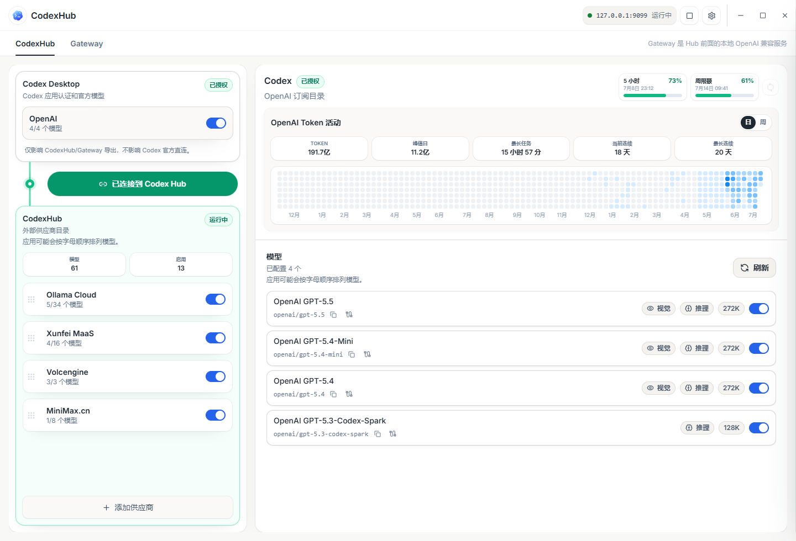
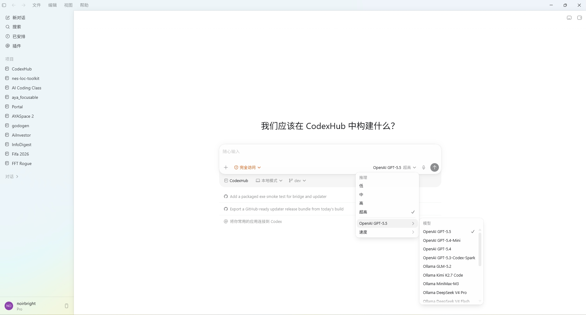
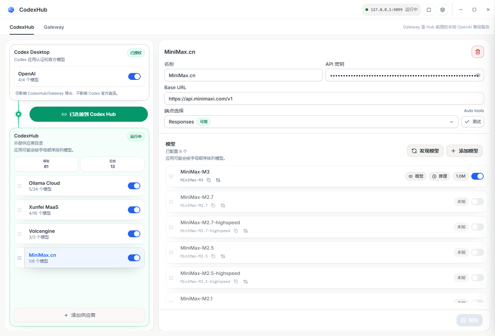
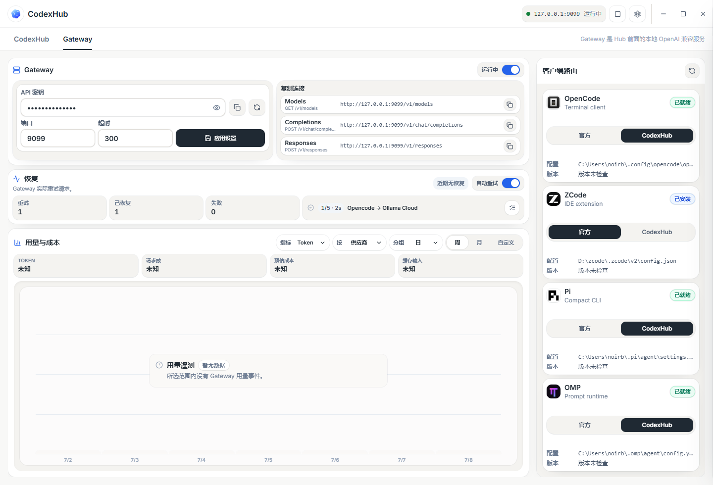
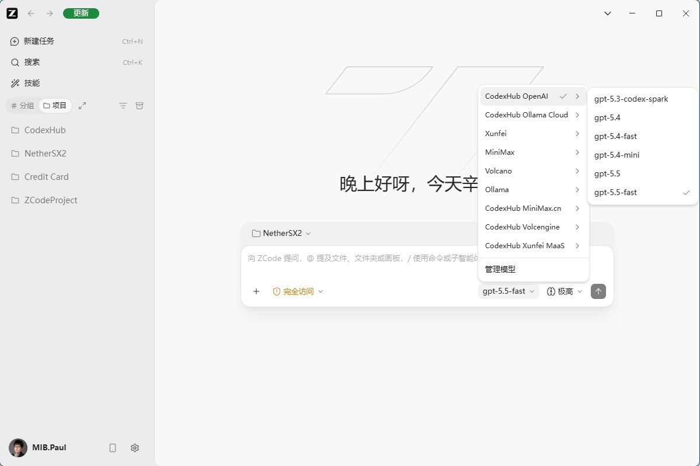
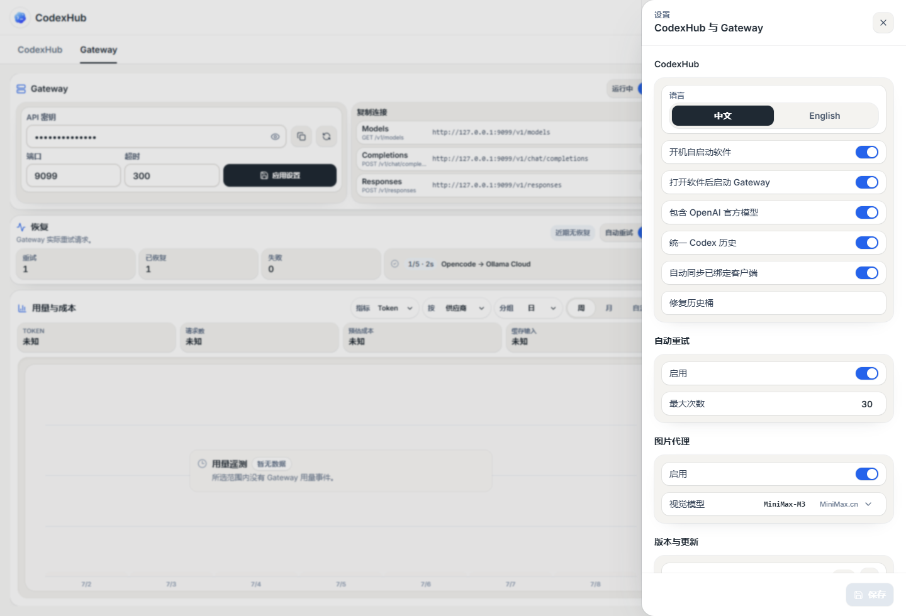
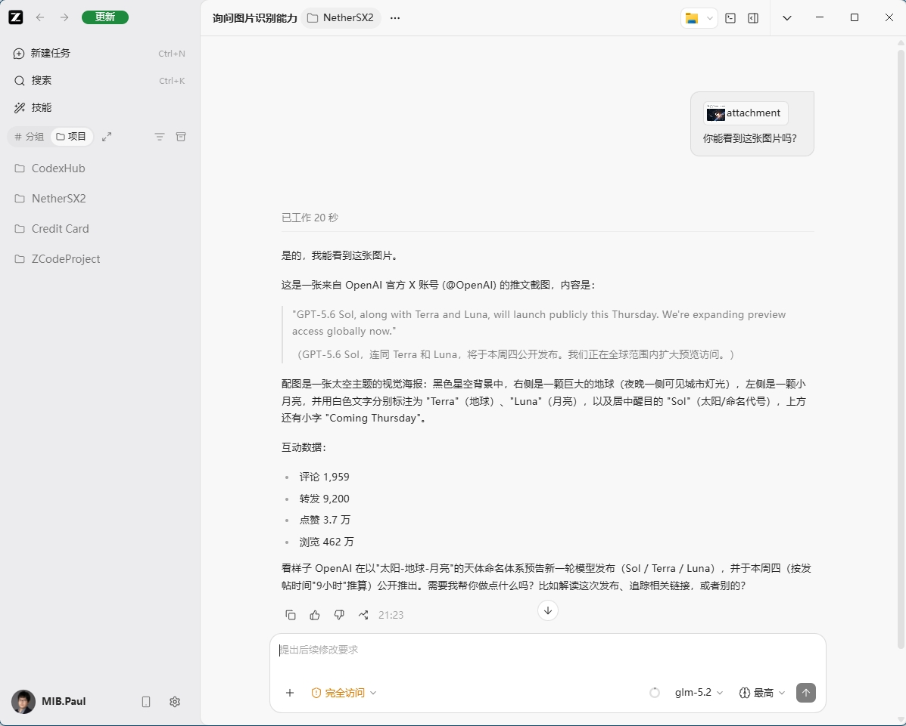

# CodexHub

> 中文 | [English](README.md)

> 把 Codex 官方模型和第三方模型统一接入 Codex 与其他编程工具，尽量保持透明代理，只在必要时做协议兼容、能力适配和用量统计。

CodexHub 是一个本地 Gateway + 桌面管理工具。它让 Codex Desktop 可以在同一个模型目录中同时使用官方 GPT 模型和第三方模型，也把这些模型导出成一个本地 OpenAI 兼容端点，供 OpenCode、ZCode、Pi、OMP 等工具使用。

## 工作方式

```text
Codex Desktop App
        |
        |  http://127.0.0.1:9099
        v
CodexHub Gateway
        |-- Official Codex / ChatGPT subscription models
        |-- OpenAI-compatible providers
        |-- Responses API providers
        `-- Chat Completions providers

CodexHub Desktop App
        |-- configure providers and models
        |-- generate Codex model catalog
        |-- start / stop / monitor Gateway
        `-- configure external coding clients
```

连接 Codex 后，Gateway 需要保持运行，因为 Codex 的模型请求会发到本地端点。对官方 GPT 模型，CodexHub 尽量作为透明代理：复用本机 Codex 登录态转发请求，只做必要的鉴权注入、请求兼容、用量记录和健康检查。对第三方模型，Gateway 会根据 Provider 配置选择最接近的上游协议，并在能力不一致时做最小必要转换。

桌面 App 和 Gateway 是独立生命周期。关闭窗口会最小化到托盘，不会自动停止 Gateway；你也可以在 UI、托盘菜单或 CLI 中手动启动、停止、重启 Gateway。

**图 1：真实账号的 Provider 目录与连接状态**



## 核心功能

- **Codex 多模型目录**：在 Codex 中同时看到官方订阅模型和第三方模型。
- **透明官方代理**：官方 GPT 模型走 Codex / ChatGPT 登录态，不要求外部工具理解 OpenAI 订阅。
- **Provider 能力适配**：支持按 Provider 配置 Responses 或 Chat Completions 端点，并可通过 Probe 自动检测。
- **协议转换**：在客户端和上游协议不一致时，在 Responses API 和 Chat Completions 之间转换请求与响应。
- **Codex 能力兼容**：对第三方模型尽量保留 Codex 的工具调用、子代理和流式交互能力；实际效果取决于上游模型与 Provider 的工具/流式支持。
- **外部 Gateway**：导出 `/v1/models`、`/v1/responses`、`/v1/chat/completions`，并支持按 Provider 分流的端点。
- **Vision Proxy**：当目标模型不支持图片输入时，可自动用配置的视觉模型读取图片，再把图片内容转成文本上下文交给非视觉模型。
- **用量与恢复事件**：记录请求、Token、缓存命中、预估成本、重试恢复和错误事件。
- **托管客户端配置**：可为 OpenCode、ZCode、Pi、OMP 生成或应用本地 Gateway 配置。
- **桌面更新与自启动**：支持检查更新、安装更新、开机启动软件和打开软件后启动 Gateway。

## 快速开始

1. 从 [Releases](../../releases) 下载并安装 CodexHub。
2. 确保 Codex Desktop / Codex CLI 已登录 ChatGPT 订阅账号。
3. 打开 CodexHub，确认 Gateway 状态为 running；如果未运行，点击 Start。
4. 在 CodexHub 页面点击 Connect to Codex Hub，让 Codex Desktop 使用本地 Gateway。
5. 添加第三方 Provider，填写 `base_url`、API key 和模型列表。
6. 不确定端点类型时点击 Probe，CodexHub 会检测 Provider 更适合 Responses 还是 Chat Completions。
7. 启用需要暴露给 Codex/Gateway 的模型，刷新模型目录后回到 Codex 选择模型使用。
8. 需要接入其他编程工具时，打开 Gateway 页面，复制通用连接信息或对支持的客户端执行托管配置。

发布版安装包随附普通使用所需的运行时；普通用户不需要额外安装 Python、Node.js 或 Rust。从源码开发时仍需要本机具备 Node.js、Rust/Tauri 工具链和 Python 运行环境。

## Release 与 Beta 通道

CodexHub 正式版默认使用前端端口 `1420`、桥接端口 `1421`、Gateway 端口 `9099`，并使用 `%USERPROFILE%\.codex`。

CodexHub Beta 默认使用前端端口 `1430`、桥接端口 `1431`、Gateway 端口 `9109`，并使用 `%USERPROFILE%\.codexhub-beta\codex-home`。Beta 不会在首次启动时自动接管正式版 Codex 配置。

客户端路由状态以目标配置为准：`Official`、`Release` 或 `Beta`。当某个目标由另一个通道管理时，当前 App 会显示 `Managed by Release` 或 `Managed by Beta`，需要显式确认后才会接管。

## 使用说明

### 连接 Codex

CodexHub 会改写 Codex 配置中的模型 Provider，使 Codex 请求发往本地 Gateway。连接后：

- 官方模型仍然是官方 Codex / ChatGPT 订阅模型，只是请求经过本地 Gateway。
- 第三方模型会显示在同一个模型目录中，模型 ID 通常是 `provider/model`。
- Gateway 停止时，CodexHub 模式下的 Codex 请求无法继续转发；切回 Official 可恢复 Codex 官方直连。
- 默认端口是 `9099`，本地地址是 `http://127.0.0.1:9099`。

CodexHub 的目标不是替代 Codex 的协议，而是尽量透明地站在 Codex 和上游之间：官方模型少动，第三方模型只在必要时做兼容和修复。

**图 2：在 Codex 中同时使用官方模型和第三方模型**



### 配置 Provider

每个 Provider 至少需要：

- `name`：显示名称。
- `base_url`：上游 API 地址。
- `api_key`：可以直接填写，也可以使用 `{env:ENV_NAME}` 引用环境变量。
- `upstream_format`：上游端点类型，通常是 `responses`、`chat_completions` 或 `auto`。
- 模型列表：每个模型可设置显示名、上下文长度、输出上限、是否启用、是否导出到 Gateway。

如果不确定上游能力，使用 Probe。Probe 会检查模型列表、Responses、Chat Completions、工具调用和流式工具调用等能力，并给出推荐端点类型。配置越准确，Gateway 越能少做转换，透明度越高。



### 能力不兼容时如何处理

Gateway 优先尊重 Provider 配置：

- 客户端使用 Responses，上游也是 Responses 时，尽量透明转发。
- 客户端使用 Chat Completions，上游也是 Chat Completions 时，尽量透明转发。
- 客户端和上游协议不一致时，Gateway 会做 Responses ↔ Chat Completions 转换。
- 第三方模型缺少 Codex 所需工具语义时，Gateway 会按配置的 tool protocol 做工具结构兼容或文本兼容。
- 上游流式输出中断、空响应或可重试错误时，Gateway 会按策略重试，并把恢复事件记录到日志和 UI。

对 Codex 本身，第三方模型会走更强的 Codex 兼容适配；对外部工具，Gateway 会尽量保持 OpenAI 兼容服务的行为。

### 外部 Gateway

Gateway 对外提供本地 OpenAI 兼容端点：

```text
GET  /health
GET  /v1/models
POST /v1/responses
POST /v1/chat/completions
POST /v1/providers/{provider}/responses
POST /v1/providers/{provider}/chat/completions
```

通用客户端可以使用：

```text
Base URL: http://127.0.0.1:9099/v1
API key:  CodexHub 设置中的 Local client key
Model:    gpt-5.5 或 provider/model
```

官方 OpenAI 模型使用裸 ID；旧版 `openai/gpt-*` 别名仍作为兼容输入保留。

按 Provider 分流时，客户端可以使用：

```text
Base URL: http://127.0.0.1:9099/v1/providers/{provider}
Model:    model
```

Gateway 页面会检测 OpenCode、ZCode、Pi、OMP 的本地配置位置，支持复制配置、预览配置、应用到 CodexHub 路由、恢复官方配置。



**图 3：在不支持 OpenAI auth 登录的软件上使用你的 OpenAI 订阅**



### Vision Proxy

Vision Proxy 用来让非视觉模型处理带图片的请求。开启后需要选择一个支持图片输入的视觉模型作为读取图片的模型。

触发条件：

- 请求里包含图片输入。
- 当前目标模型没有标记为支持 `image` 输入。
- Settings 中已开启 Image Proxy，并配置了可用的 Vision model。

处理方式：

1. Gateway 先调用配置的视觉模型读取图片。
2. 图片描述会写入本地缓存，避免相同图片重复读取。
3. Gateway 把原图片片段替换为文本形式的视觉上下文。
4. 非视觉目标模型收到的是普通文本请求，不需要自己支持图片。

如果目标模型本身支持图片输入，Gateway 不会替换图片。如果目标模型不支持图片且 Vision Proxy 未开启或视觉模型不可用，Gateway 会阻止请求继续发送，避免把图片直接交给文本模型导致上游失败。

Provider 模型默认按文本模型处理。某个第三方模型确实支持图片时，需要在模型能力中勾选 Vision，或在配置中加入 `input_modalities = ["text", "image"]`。



**图 4：让没有视觉的模型也能看到图片**



## 从源码开发

```powershell
cd frontend
npm install
npm run build

cd ..\src-tauri
cargo tauri dev
```

常用检查：

```powershell
cd frontend
npm run build
npm run test:ui-contract

cd ..\src-tauri
cargo test

cd ..
python -m pytest
```

源码运行 Gateway 时需要 Python 可用。可通过 `CODEXHUB_PYTHON` 或 `CODEXHUB_PROXY_PYTHON` 指定 Python 路径。

## 和其他方式的区别

| 能力 | Codex 原生 | 纯切换工具 | CodexHub |
| --- | --- | --- | --- |
| 官方订阅模型 | 支持 | 通常不可同时保留 | 支持 |
| 第三方模型 | 不支持 | 支持 | 支持 |
| 官方和第三方同目录 | 不支持 | 不支持 | 支持 |
| Codex 高级能力 | 支持 | 通常受限 | 尽量兼容 |
| 无需重启切换 | - | 通常需要 | 支持 |
| 外部 OpenAI 兼容端点 | 不提供 | 不提供 | 提供 |
| 用量与恢复事件 | 有限 | 取决于工具 | Gateway 统一记录 |

## FAQ

### 连接 Codex 后为什么 Gateway 必须运行？

因为 Codex 已被配置为请求本地 Gateway。Gateway 负责把请求转发到官方 Codex 后端或第三方 Provider。停止 Gateway 后，CodexHub 模式下的请求没有本地服务可连接。

### 官方模型需要 OpenAI API Key 吗？

不需要。官方模型复用本机 Codex / ChatGPT 登录态。Gateway 会读取并刷新 Codex 的本地认证信息，用于转发官方模型请求。

### Provider 的端点类型填错会怎样？

端点类型决定 Gateway 如何构造上游请求。填错可能导致 404、参数错误、工具调用失败或流式响应异常。不确定时使用 Probe，并按推荐结果保存。

### CodexHub 会不会改变我的请求？

官方模型路径尽量透明。第三方模型路径会在必要时做协议转换、工具兼容、图片代理、重试和统计。目标是让请求能在不同 Provider 能力之间工作，同时尽量减少不必要改写。

### 为什么非视觉模型也能处理图片？

开启 Vision Proxy 后，Gateway 会先用你配置的视觉模型读图，再把图片内容作为文本上下文交给非视觉模型。非视觉模型并没有直接看到图片。

### 如果模型本来支持图片，是否还会走 Vision Proxy？

不会。只要该模型元数据包含 `image` 输入能力，Gateway 会让图片原样进入目标模型。若模型支持图片但未正确标记，请在模型能力中勾选 Vision。

### 子代理、Computer Use、Browser 都能用吗？

CodexHub 会尽量保留 Codex 原生能力，并对第三方模型做工具协议适配。但最终效果取决于上游模型是否稳定支持工具调用、流式输出和长上下文。建议对每个 Provider 先 Probe，再用小任务验证。

### 外部工具为什么要配置 Local client key？

Local client key 是本地客户端访问 Gateway 的兼容密钥，不是上游 Provider 的 API key。上游密钥仍由 Provider 配置管理。

### 用量和成本为什么有时显示 Unknown？

Token 和成本依赖上游返回 usage 字段，以及本地模型价格元数据。某些 Provider 不返回完整 usage，或者模型没有 USD 价格元数据时，Gateway 只能记录请求事件，不能精确估算成本。

### 普通用户需要安装 Python、Node.js 或 Rust 吗？

发布版安装包随附普通使用所需的运行时，不需要额外安装这些开发工具。从源码开发、调试或运行未打包版本时才需要本机环境。

## License

MIT
