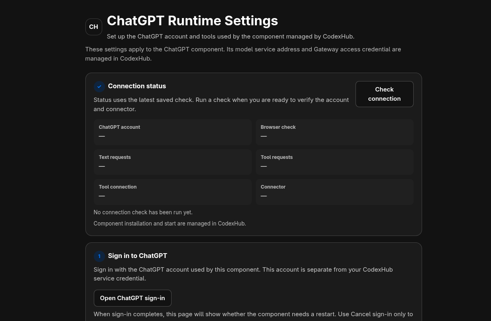
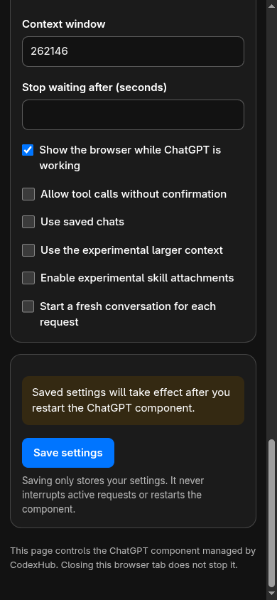

# External settings browser acceptance

These are retained browser checks from the #584 implementation, not a claim
that a newly rebased application package has already been tested. The settings
HTML is byte-identical between the initial browser candidate
`3ed43ff288e88a088656a4794492e6a6cb5106ba`, packaged candidate
`06cd406180a682f2c09aaa9d15dec6124da37e4e`, and review fix `2b8f42fe`.

## Empty-account rendered checks

T3's AM01S browser successfully opened the settings page, edited the context
window, clicked Save, displayed the explicit component-restart notice, and
restored the saved value after reload. Active configuration stayed unchanged.
The page displayed unchecked account/readiness state, not a successful login.

Desktop and narrow layouts were inspected. At the 390 × 844 narrow viewport,
the document's measured scroll width was 375; no inspected section, input,
select, or button extended past the viewport, and inputs/selects had labels.
The screenshots below contain only empty-account state and nonsensitive test
options. No real account or credential form was captured.

An earlier Windows-hosted T3 session could submit the rendered form through
`requestSubmit`, but its snapshot/click automation was unreliable. The later
AM01S rendered click supplied the missing browser interaction evidence; it
does not imply Windows physical-pointer acceptance.

## Packaged settings flow

On Linux package `06cd4061`, the native `chatgpt_web_open_settings` command
opened the settings page. The one-use bootstrap fragment was removed; stored
secret inputs stayed empty with a saved-secret notice. Submitting unchanged
settings and reloading preserved the form and readiness. No screenshots of
that real-account form or secret values were collected.

Navigation to `about:blank` unloaded that document while the same runtime PID
remained healthy and accepting turns. This is document-unload evidence, not a
claim that automation closed a native browser tab. The separate packaged live
text/tool checks are recorded in [settings acceptance](settings-acceptance.md).
