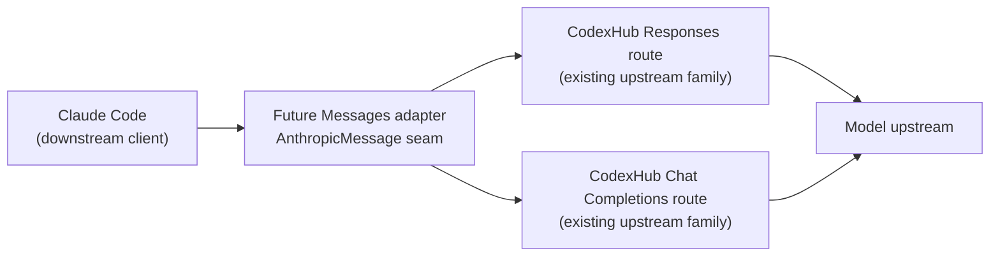
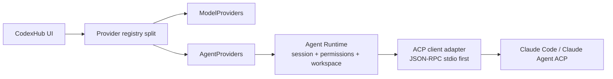

# v0.3 AgentProvider / ACP Roadmap

Date: 2026-07-09
Updated: 2026-07-12 after Issue #74 Messages compatibility Spike

## Purpose

This roadmap separates two Claude Code relationships that have different
interfaces, risks, ownership, and delivery gates:

| Relationship | Direction | Product shape | Current decision |
| --- | --- | --- | --- |
| Claude Code as a Gateway client | Claude Code -> CodexHub -> model upstream | Anthropic Messages compatibility adapter | Scoped PARTIAL Spike only; no production route yet |
| Claude Code as an agent runtime | CodexHub -> Claude Code / ACP process | AgentProvider, session, workspace, permissions, and event lifecycle | Separate v0.3 AgentProvider/ACP work; not changed by Issue #74 |

Do not use the word “provider” alone when the direction is relevant. A
downstream Claude Code client is not an `AgentProvider`, and an `AgentProvider`
is not a model-inference `ModelProvider`.

## Existing AgentProvider decision

Claude Code/ACP is not a normal `ModelProvider`. A model request is mostly
stateless inference, while an agent runtime has a workspace, permission prompts,
tool/process lifecycle, resumable state, diffs, and task-level telemetry.

If CodexHub later supports ACP or a Claude Code agent runtime, it needs distinct
domain objects:

- `AgentProvider`: command, arguments, environment policy, workspace policy,
  MCP configuration, authentication, permission policy, enabled state;
- `AgentSession`: provider, workspace root, lifecycle status, timestamps,
  capabilities, last event;
- `AgentEvent`: messages, tool lifecycle, permission requests, diffs, terminal
  output, completion/failure/cancellation, and optional usage.

That work belongs behind a separate Agent Runtime seam and should not be forced
into `src-tauri/src/gateway.rs`, Gateway request rows, `/v1/responses`, or
`/v1/chat/completions`.

## Downstream Messages clarification from Issue #74

Issue #74 investigated only an external Claude Code client talking to a future
CodexHub Gateway. The official Claude Code gateway contract selects Anthropic
Messages with `ANTHROPIC_BASE_URL`; it requires incremental Messages SSE and
uses open-set Anthropic/Claude Code headers and request fields.

The isolated prototype established these limited points:

- basic Messages text/history and client-tool IDs can adapt in memory to
  Responses and Chat Completions shapes;
- Responses and Chat Completions event fixtures can emit a valid Messages SSE
  lifecycle with reported base usage, explicit rejection of unmapped
  cache/reasoning usage detail, and an explicit error envelope;
- a real local Claude Code 2.1.201 loopback smoke returned text, performed a
  `Read` tool -> matching `tool_result` follow-up with a stable fixture ID, and
  showed a downstream connection close after forced process termination;
- the same real request included adaptive thinking, effort output configuration,
  cache-control-bearing blocks, and open Anthropic beta/header fields that the
  strict non-Anthropic translator correctly marked non-forwardable.

The resulting decision is **scoped PARTIAL**, not a release gate. See
[ADR-0001](../adr/0001-claude-messages-intermediate-representation.md) and
[the evidence note](../research/2026-07-12-claude-code-external-client-support.md).

## Architectural consequences

Before any downstream Messages implementation, introduce a pure
`AnthropicMessage` intermediate representation. It is a model-protocol seam,
not an agent-session model. It owns ordered content blocks, tool IDs, header
classification, explicit adaptations, and non-forwardable outcomes. It must not
be hidden inside the existing Gateway HTTP handler.

The downstream path may eventually look like this:



The separate upstream-agent path remains:



Neither diagram authorizes the other path.

## Sequencing

```text
Issue #74 protocol Spike (scoped PARTIAL)
  -> future Messages field-policy and real-upstream validation
  -> optional production Messages adapter
  -> optional Claude Code client configuration UI

Separate AgentProvider / ACP design and implementation
  -> Agent Runtime with session + permission semantics
  -> local ACP smoke
  -> optional Agent Gateway, never implicit model Gateway reuse
```

The downstream track must not wait for ACP work merely because both mention
Claude Code. Conversely, it must not introduce `AgentProvider`, ACP, workspace
permissions, or agent telemetry as a shortcut around Messages compatibility.

## Required gates before either path advances

### Future downstream Messages route

1. Decide, document, and test an explicit policy for every current strict
   rejection: thinking, output effort, cache controls, beta/body pairs, headers,
   image/provider capability, count tokens, retries, and cancellation.
2. Validate against an approved real official Codex/OpenAI route and a real Chat
   Completions Provider; fixture-shape tests are insufficient.
3. Preserve or reject new open-set fields with a named outcome. Never silently
   strip only a header or only its paired body field.
4. Keep a real pinned Claude Code text/tool/history/cancellation trace sanitized
   and repeat it on CLI upgrades.
5. Add the production route only after these gates are accepted in a follow-up
   issue. Client auto-configuration follows the route, not the reverse.

### Separate AgentProvider / ACP work

1. Create the provider registry split and Agent Runtime seam.
2. Prove local stdio startup, session creation, permission events, cancellation,
   and safe workspace policy in a standalone harness.
3. Keep agent task telemetry separate from Gateway model-request telemetry.
4. Consider an Agent Gateway only after real agent-session clients require it.

## Explicit non-goals

This roadmap update does not implement or authorize:

- `POST /v1/messages` or `/v1/messages/count_tokens` in the production Gateway;
- changes to `codex_proxy.py` route handling;
- Claude Code launcher, config writer, or model-discovery UI;
- AgentProvider/ACP work tracked separately, including Issue #85;
- treating a Claude Code subscription as an upstream provider credential.
